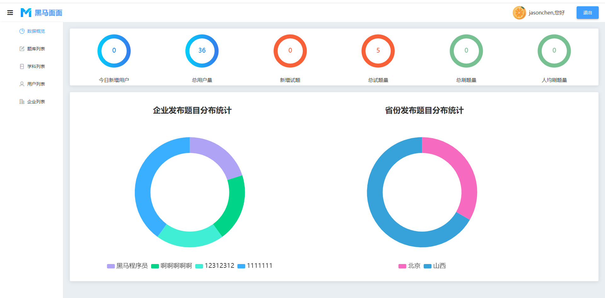
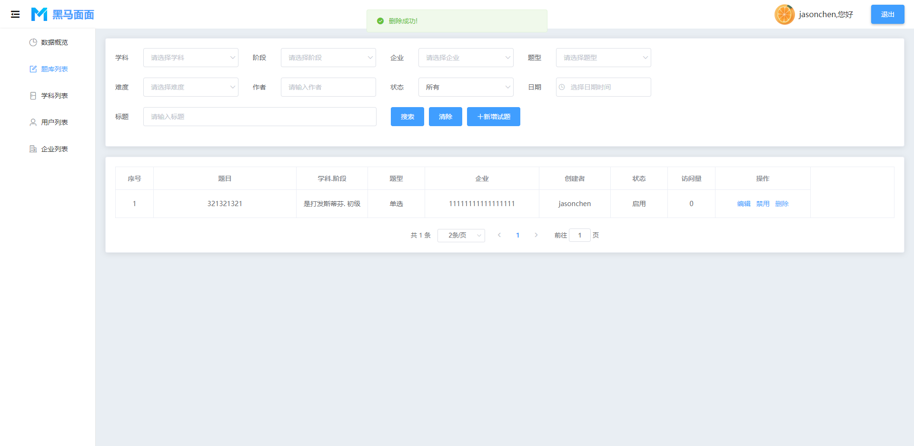
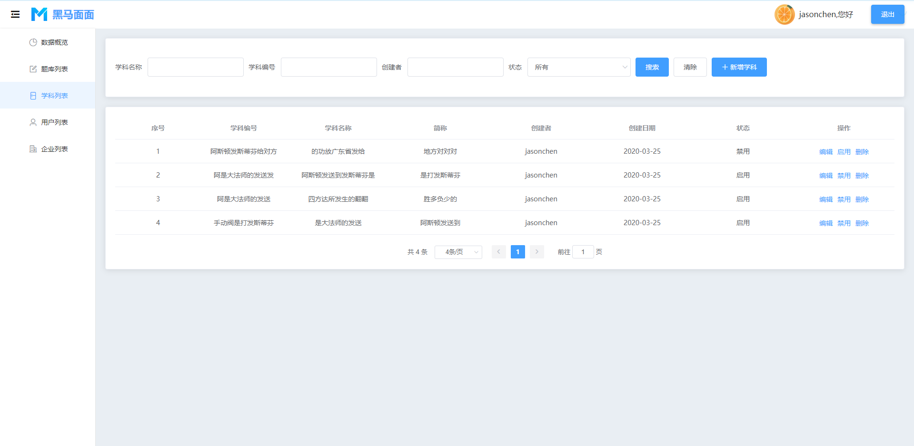
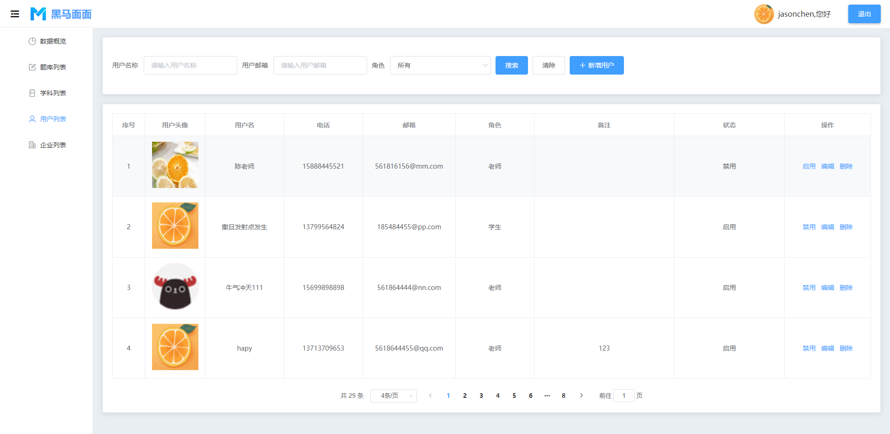
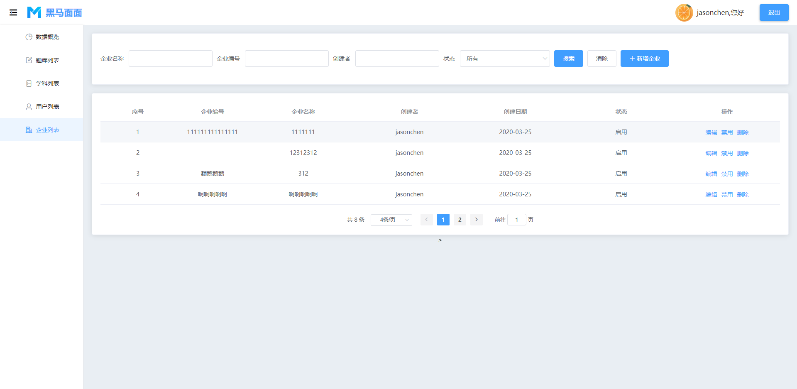

# VUE-PC端后台管理系统

## 安装依赖包
```
npm install
```

### 运行项目
```
npm run serve
```

### Compiles and minifies for production
```
npm run build
```

### Lints and fixes files
```
npm run lint
```

项目概况:












